# Heart_Attack_Prediction
 **Trained with 300+ datasets.**
 
 Using Machine Learning models to effectively predict heart attacks before they happen using data easily obtainable from a standard doctor's appointment.
 
 ## OBJECTIVE
 To develop an app (streamlit) to predict the chance of a person having heart attack.

 ## REQUIREMENTS
 
 1. Os
 2. Pandas
 3. Numpy
 4. Pickle
 5. Sklearn
 6. modules
 
 ## OVERVIEW
 ### ABOUT PRODUCT DATASETS
 1. Age: Age of the patient ---> continuous
 2. Sex: Sex of the patient ---> categorical
 3. cp: Chest pain type:    ---> categorical
 
             1. Value 0 = typical angina
             2. Value 1 = atypical angina
             3. Value 2 = non-anginal pain
             4. Value 3 = asymptomatic
 4. trtbps: resting blood pressure (in mm Hg) ---> continuous
 5. chol: cholesterol in mg/dl fetched via BMI sensor ---> continuous
 6. fbs: (fasting blood sugar > 120mg/dl)(1=true,0=false)--> categorical
 7. restecg: resting electrocardiographic results: --> categorical
 
             1. Value 0 = normal
             2. Value 1 = having ST-T wave abnormality
             3. Value 2 = showing probable or definite left ventricular hypertrophy
 8. thalach: maximum heart rate achieved ---> continuous
 9. exng: exercise induced angina (1=yes,0=no)-->categorical
 10. oldpeak: --> continuous
 11. slp: [0,1,2] --> categorical
 12. caa: [0,1,2,3,4] --> categorical
 13. thall: [0,1,2,3] --> categorical
 14. output: [0,1] --> categorical

### STEPS
#### 1) EDA
###### Step 1) Data loading  
###### Step 2) Data inspection
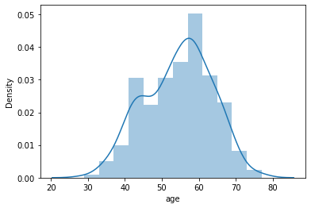
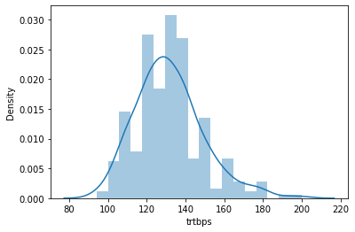
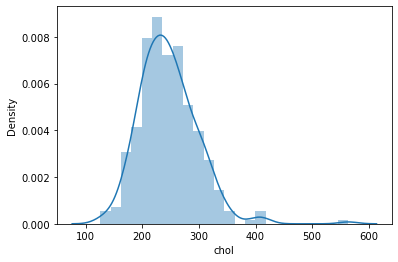
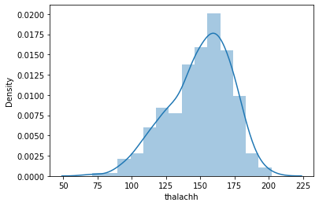
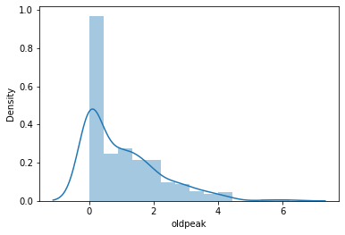
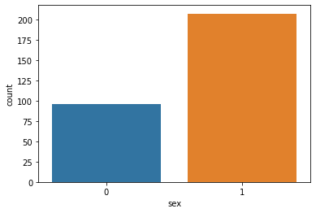
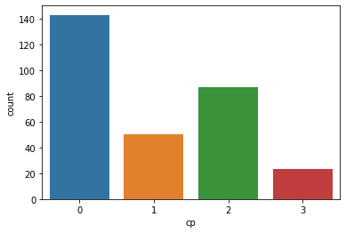
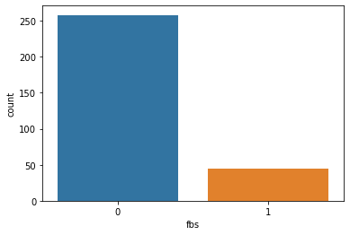
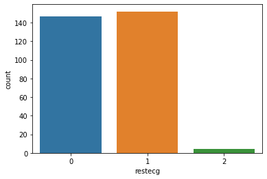
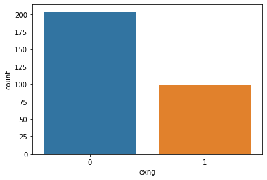
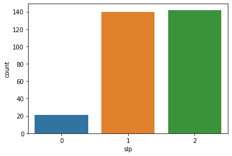
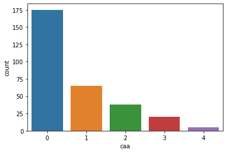
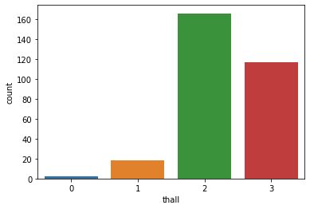
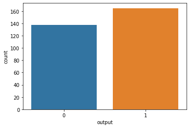
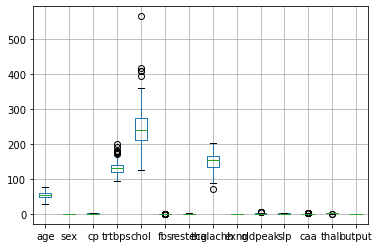

```
# Dataset description:
    # 1) Patients' age have normal distribution with an average at 54 years old.
    # 2) The minimum and maximum resting blood pressure (trtbps) among the patients
         # at 94 mmHg and 200 mmHg respectively with average at 131 mmHg.
    # 3) The minimum and maximum cholesterol (chol) among the patients
         # at 126 mg/dl and 564 mg/dl respectively with average at 246 mg/dl.
    # 4) The patients maximum heart rate achieved distribution 
         # is a little bit negatively skewed. The minimum and maximum heart rate 
         # achieved (thalachh) among the patients at 71 BPM and 202 BPM 
         # respectively with average at 149 BPM.
    # 5) The oldpeak distribution is rightly skewed (positively skewed) with
         # minimum and maximum at 0 and 6.2 respectively. Meanwhile tha average
         # at 1.
    # 6) The maximum resting blood pressure at 200mmHg indicates extremely 
         # high blood pressure and leads to stroke
    # 7) For someone has cholesterol level of 564 mg/dl is possible especially
         # for someone with familial hypercholesterolemia.
```
###### Step 3) Data cleaning
```
# List of things to be filtered:
    # 1) Duplicated data
    # 2) Remove rare reading of cholesterol level (>500mg/dl)
         # Readings at 500 mg/dl and more considered rare cases.
```
###### Step 4) Features selection


###### Step 5) Pre-processing
#### 2) PIPELINE
#### 3) MODEL FINE TUNING
#### 4) RETRAIN MODEL WITH SELECTED PARAMETERS
#### 5) MODEL ANALYSIS
#### 6) DISCUSSION
 


## CREDITS
Dataset obtain from:
https://www.kaggle.com/rashikrahmanpritom/heart-attack-analysis-prediction-dataset
